# **Система для анализа, мониторинга и оптимизации гранулометрического состава руды**

## ✨ Ключевые возможности

* **Анализ данных:** Выявление размера частиц (гранулометрия) используя машинное обучение
* **API:** RESTful API для доступа к данным и функциям системы.
* **Универсальность:** Мониторинг можно запускать сразу с нескольких линий производства и даже с нескольких предприятий.
* **Веб-интерфейс:** Интерактивный интерфейс для визуализации данных и управления процессом. А также с обширным функционалом для мониторинга в виде всевозможных графиков и предсказания трендов.


<br></br>

# 📊 Отчет с исследованием данных

### 1) EDA

## Анализ данных и построение моделей

В рамках проекта был проведен детальный анализ данных для понимания взаимосвязей между технологическими параметрами и предсказания целевой переменной `Гранулометрия %`.

### 1. Загрузка и первичный осмотр данных

*   Данные были загружены из файла `../data/all_data.parquet`.
*   Проведена первичная оценка данных, включая размерность и список признаков.
*   Построена матрица корреляции для всех числовых параметров для выявления первоначальных взаимосвязей. `Поток л/мин` показал наиболее высокую положительную корреляцию (0.83) с `Гранулометрия %`.

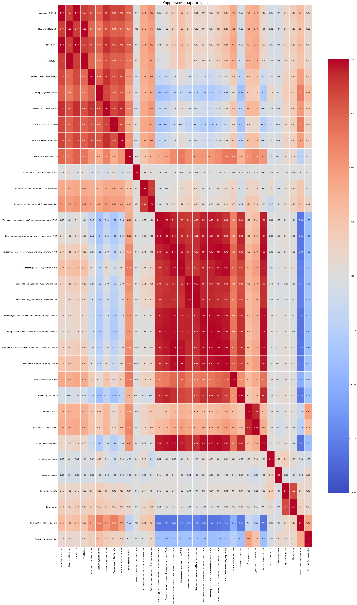


### 2. Предобработка данных

*   **Анализ пропусков:** Выявлено небольшое количество пропусков в данных, наибольшее число (17901, ~3.1%) — в столбце `Поток л/мин`.
*   **Обработка нулевых значений потока:** Обнаружено 178099 записей с нулевым значением `Поток л/мин`. Анализ показал, что в 99.998% этих случаев `Гранулометрия %` также равна нулю, что указывает на остановку процесса. Эти строки были удалены из набора данных.
*   **Заполнение пропусков:** Оставшиеся пропуски в `Поток л/мин` были заполнены медианным значением после удаления нулевых строк.
*   **Анализ распределения потока:** Изучено распределение параметра `Поток л/мин` с помощью гистограмм, box plot, Q-Q plot и violin plot. Распределение близко к нормальному, с небольшой асимметрией и эксцессом.
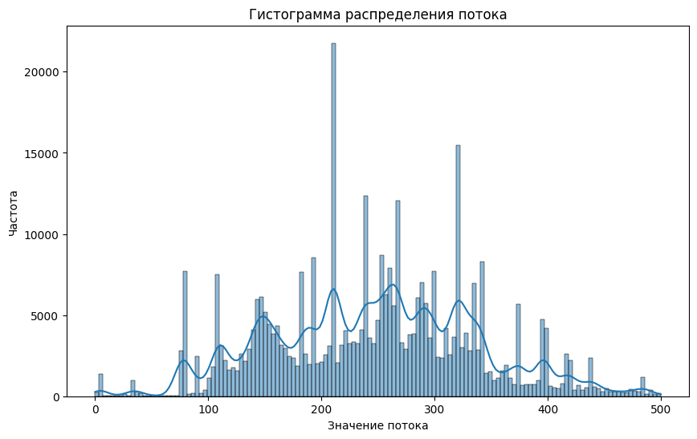
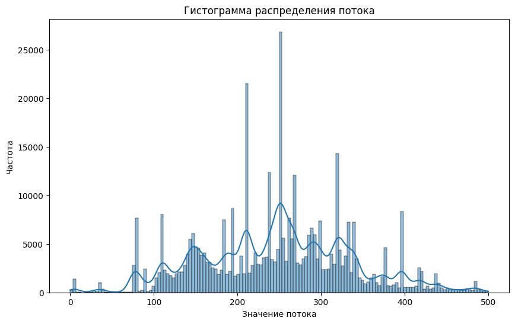
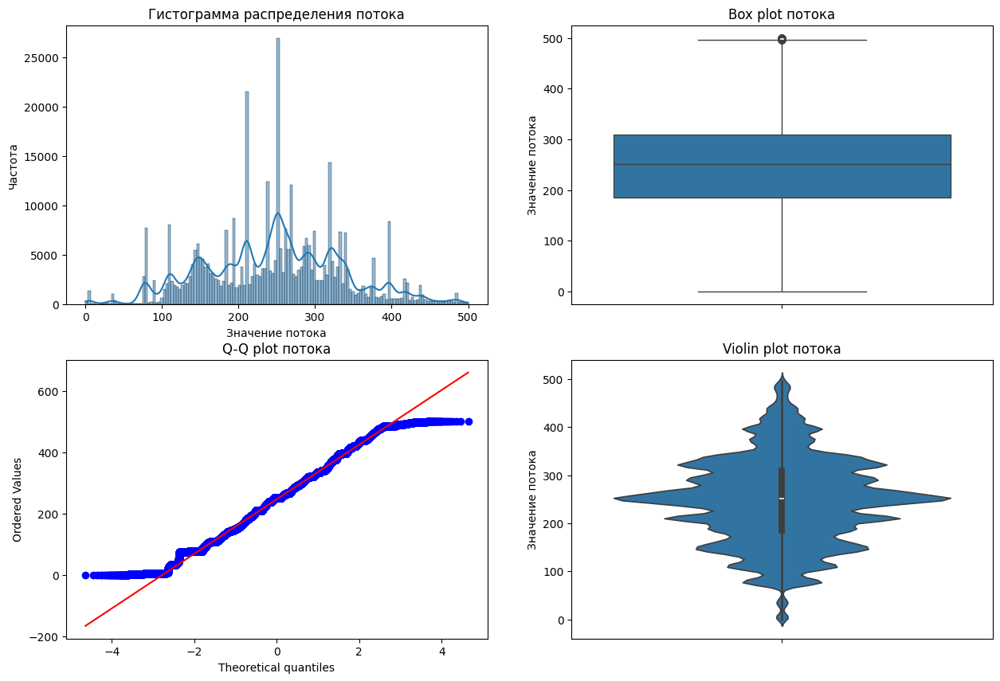
*   **Выбросы:** Выбросы в `Поток л/мин` были идентифицированы с использованием межквартильного размаха (IQR). Они составили всего 0.05% данных. На данном этапе выбросы не удалялись.
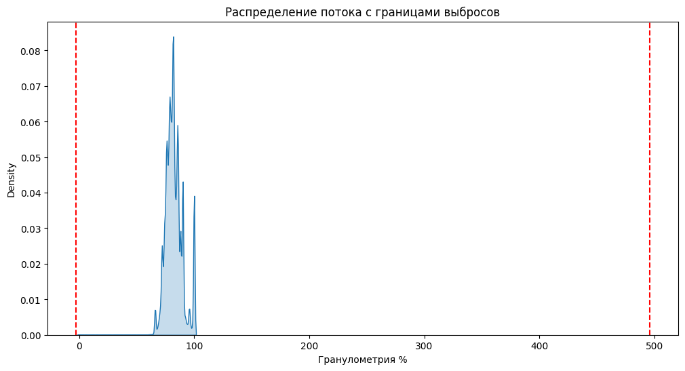
*   **Обработка временного признака:** Столбец `Время` преобразован в числовой формат для использования в моделях.
*   **Удаление оставшихся пропусков:** Все строки с оставшимися пропусками в других столбцах были удалены перед обучением моделей.
*   **Сохранение обработанных данных:** Очищенный датасет сохранен в `../data/data_after_analys.parquet`.

### 3. Визуализация зависимостей

*   Построена диаграмма рассеяния для визуализации зависимости `Гранулометрия %` от `Возврат руды МПСИ т/ч`.

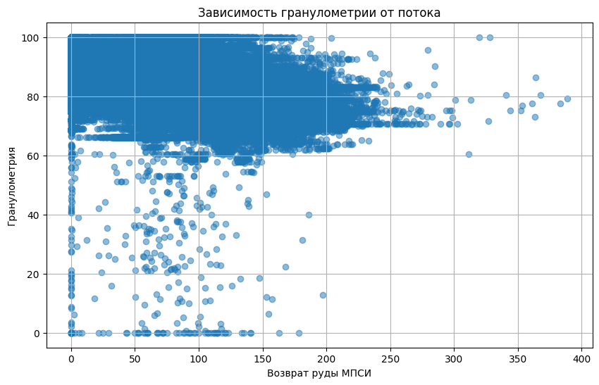

### 4. Оценка важности признаков

*   С помощью модели `RandomForestRegressor` была оценена важность признаков для предсказания `Гранулометрия %`.
*   Наиболее важными признаками оказались `Возврат руды МПСИ т/ч`, `Поток л/мин`, `Время`, `Температура масла основной маслостанции слив МШЦ` и `Давление на подшипник МПСИ разгрузка Бар`.

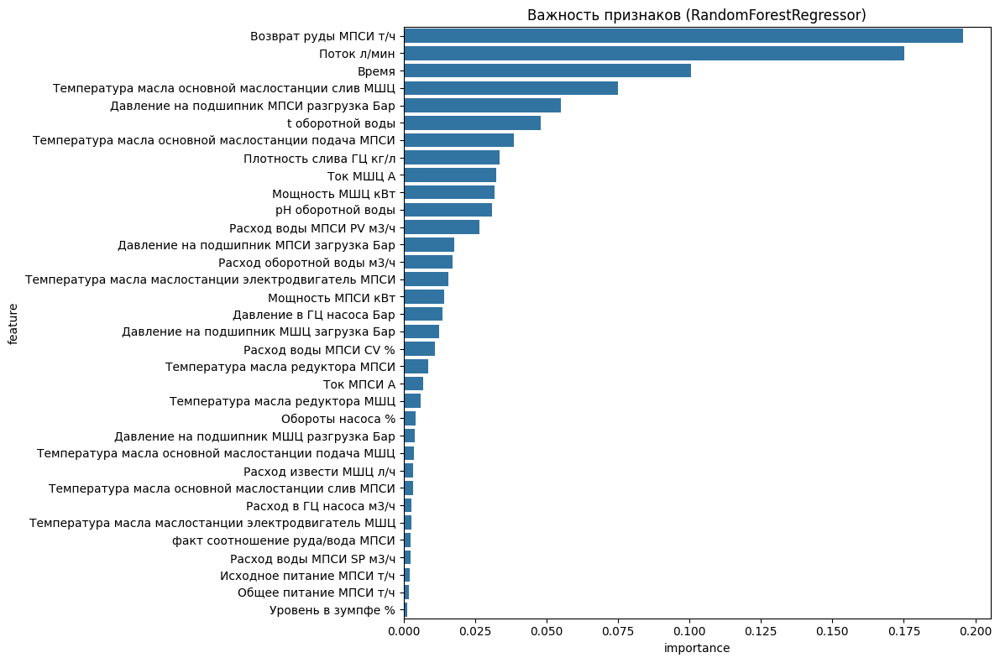

### 5. Построение и оценка моделей регрессии

Для предсказания `Гранулометрия %` были обучены и оценены три модели:

1.  **RandomForestRegressor:**
    *   Показала **наилучшее качество** предсказания.
    *   Метрики: R² = 0.9476, RMSE = 1.6806, MAE = 0.0055.
    *   Визуализация сравнения фактических и предсказанных значений RandomForestRegressor показывает хорошее совпадение.
    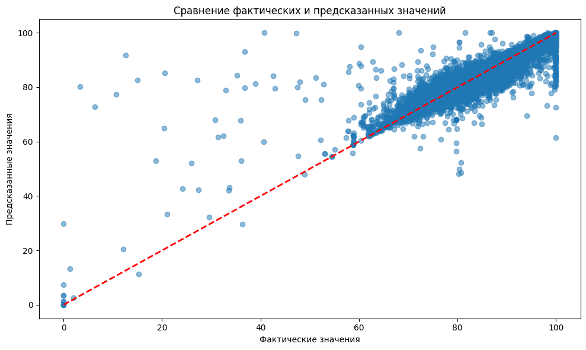
2.  **CatBoostRegressor:**
    *   Показала среднее качество.
    *   Метрики: R² = 0.6866, RMSE = 4.1113, MAE = 1.9131.
    *   Визуализация CatBoostRegressor показывает больший разброс предсказаний по сравнению с RandomForest.

    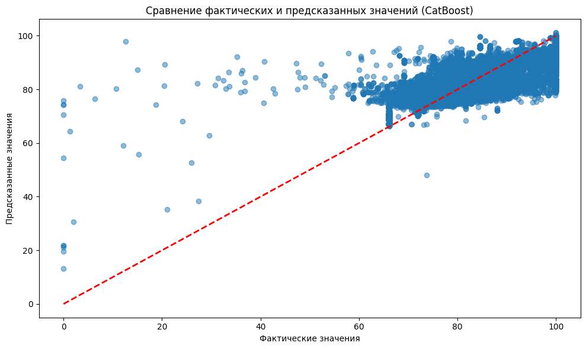
3.  **LinearRegression:**
    *   Показала **наихудшее качество** из трех моделей.
    *   Метрики: R² = 0.3538, RMSE = 5.9036, MAE = 3.3300.
    *   Визуализация LinearRegression демонстрирует значительные отклонения предсказаний от фактических значений.
    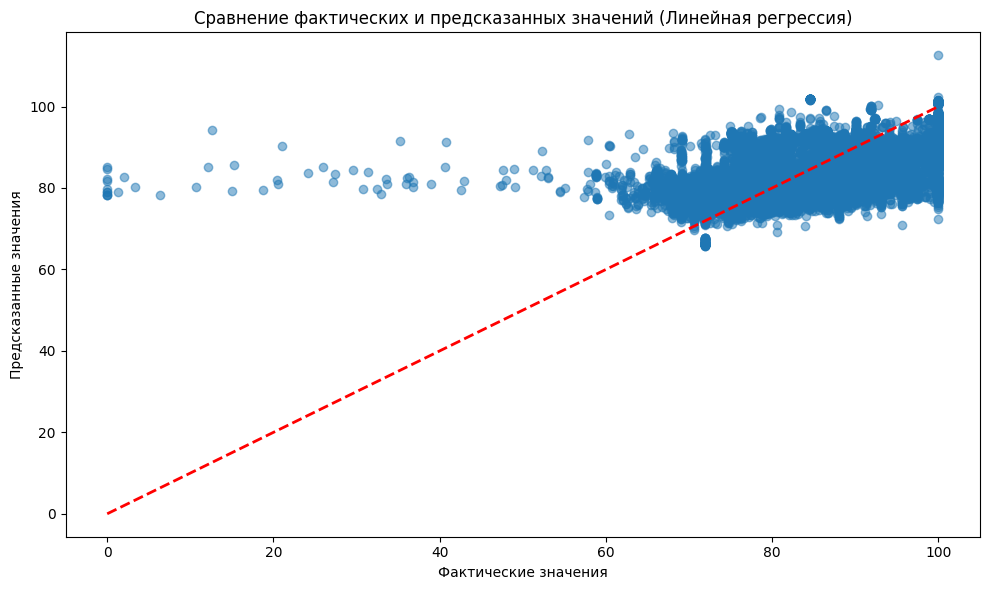

### Вывод

Анализ показал сильную зависимость гранулометрии от потока и возврата руды. Модель `RandomForestRegressor` продемонстрировала высокую точность в предсказании гранулометрии на основе доступных технологических параметров.

### 2. Первый бейзлайн - просто статистика и дальше все методы сравнивали с ним
### 3. Пайплайн нашего решения - полный пусть с отбора фичей и предобработки данных и выбором модели(желательно схема)
### 4. Эксперименты с предобработкой данных - генерация фичей(через алгебру, OpenFE, featuretools); отбор - SHAP, feature importance, boruta - брали фичи на пересечении, мы отказались от них в пользу применимости в бизнесе(так как эти методы долгие и сложные; трудно будет быстро переобучать под новые данные)
### 5. Результаты других моделей - какие были метрики у рандом Форест, ансамбля, автомл с табличным трансформером, автомл вайтбокс, автомл просто
###6. Какой лучший результат(найти его - мб в analyse или main.py Макса) и скорость алгоритма, фишки пайплайна

### 📈 Закономерности

* Частое значение входного потока: ~250 (медиана).
* Корреляция гранулометра от потока: 0.83 (после очистки).
* Сильная корреляция с возвратом руды.

### 🎯 Оптимальный размер частиц

* Целевой диапазон: 77% - 86%.

### 🖇️ Важность признаков (RandomForestRegressor)

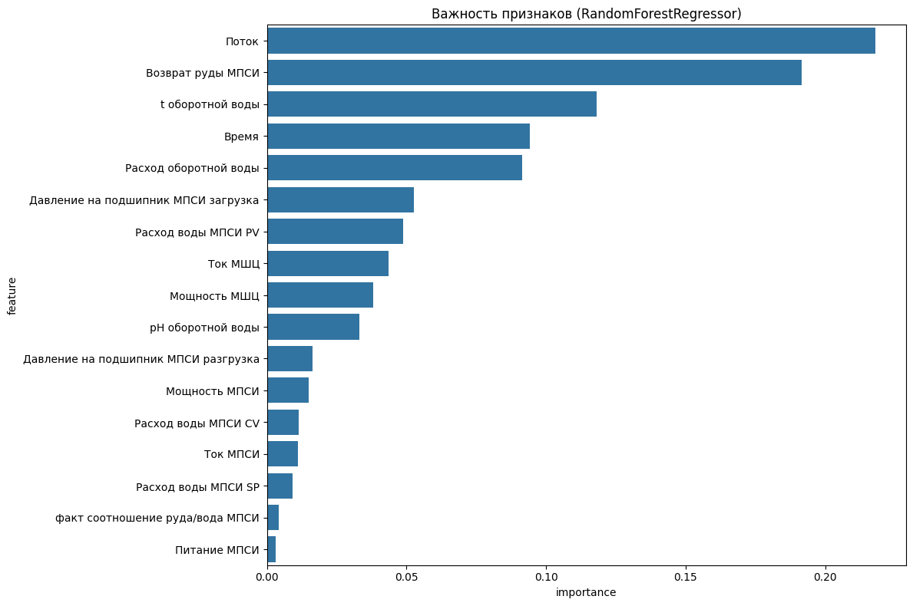

* Возврат руды МПСИ: 19.56%
* Поток: 17.52%
* Время: 10.06%
* ... (и остальные признаки)

### 📉 Метрики моделей

=

## #💡 Предлагаемые решения

### Краткосрочные меры:

* База данных для просмотра истории показаний.
* Система визуализации трендов размера частиц.
* Алгоритм определения попадания в оптимальный диапазон.

### Долгосрочные меры (при сотрудничестве фабрики):

* Система оповещения о сбоях/неверных настройках.
* Повышение точности определения гранул (сотрудничество с лабораторией).
* Учёт транспортных задержек в алгоритме.


## 🚀 Технологический стек

**Бэкенд:**

* **Язык:** Python 3.10+
* **Фреймворк:** FastAPI
* **База данных:** SQLite
* **ORM:** SQLAlchemy 2.0
* **Контейнеризация:** Docker (?)

**Фронтенд:**

* **Язык:** TypeScript
* **Фреймворк:** React
* **UI Библиотека:** Tailwind CSS, Shadcn UI
* **Сборщик:** Vite
* **Контейнеризация:** Docker (?)

**Анализ данных/ML:**

* **Scikit-learn**

## 📂 Структура проекта

```python
.
├── backend/
│   ├── model/main.py # Класс для обучения модели
│   ├── utils/ # Вспомогательные функции
│   ├── requirements.txt # Зависимости Python
│   ├── server.py # Основной файл FastAPI приложения
│   └── run.py # Скрипт для запуска сервера
├── frontend/
│   ├── src/ # Исходный код фронтенда (компоненты, страницы, стили)
│   ├── public/ # Статические ассеты
│   ├── index.html # Главная страница
│   ├── package.json # Зависимости Node.js
│   ├── vite.config.ts # Конфигурация Vite
│   ├── tsconfig.json # Конфигурация TypeScript
│   ├── .gitignore # Файлы, игнорируемые Git
│   └── ... # tailwind.config.js и т.д.
├── docs/ # Изображения для Readme
├── data/ # Файлы с данными
├── .gitignore # Файлы, игнорируемые Git
├── scaler.pkl # Обученная модель
├── model.pkl  # Обученная модель
└── README.md  # Этот файл
```

## 🛠️ Установка и запуск

1. **Клонировать репозиторий:**

   ```bash
   git clone https://github.com/MISIS-x-OptonGroup/Marathon-Digital-Solutions.git
   cd Marathon-Digital-Solutions
   ```
2. **Установить зависимости**

   ```bash
   pip install -r requirements.txt
   ```

   Бэкенд будет доступен по адресу: `http://localhost:8000/docs`
   Фронтенд будет доступен по адресу: `http://localhost:5173`

## ⚙️ API Документация

**Основные эндпоинты:**

* [GET] `/api/get`: Получить сводный статус для всех линий, ПРЕДВАРИТЕЛЬНО ОБНОВИВ ДАННЫЕ из CSV.
* [POST] `/api/add`: Добавить новую производственную линию для мониторинга.
* [DELETE] `/api/lines/{area_name}`: Удалить отслеживаемую линию и связанную с ней таблицу данных.
* [GET] `/api/lines/{area_name}`: Удалить отслеживаемую линию и связанную с ней таблицу данных.

# 📄 Лицензия: MIT
