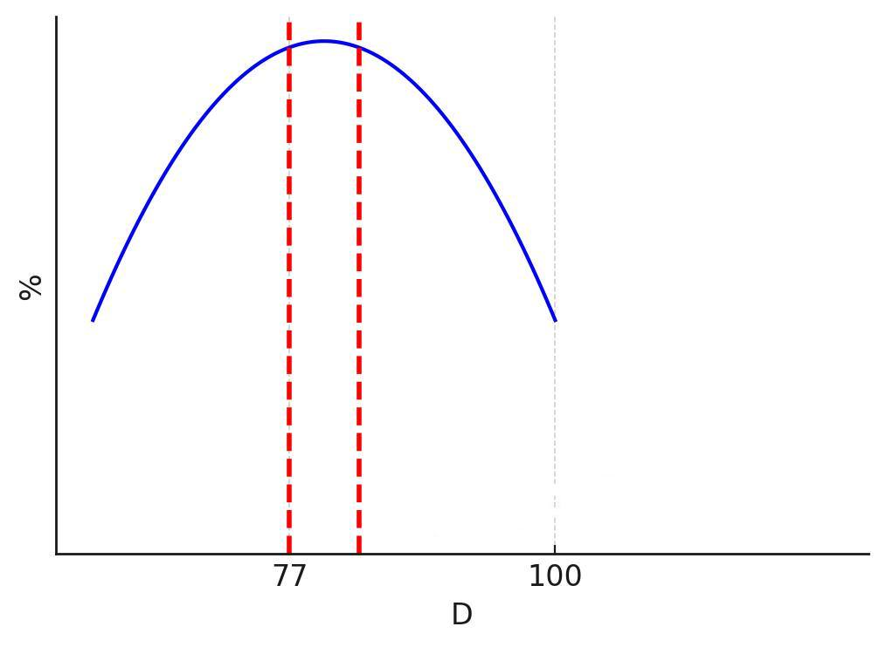

# Оптимизация процесса обогащения руды: интеллектуальный анализ гранулометрии

## 🔍 Ключевые проблемы, обнаруженные при анализе данных

При исследовании технологических данных обогатительной фабрики мы столкнулись с несколькими существенными проблемами:

- **Значительное количество нулевых значений гранулометрии**, искажающих аналитические результаты
- **Простои производства**, составляющие около трети всего времени
- **16051 пропущенное значение потока** (3% всех записей)
- **Отсутствие данных по оборотной воде** до 4 апреля
- **Транспортные задержки** между измерением и регулировкой параметров

## 📊 Выявленные закономерности

В результате анализа данных обнаружены важные зависимости:

1. **Наиболее частое значение входного потока**: около ±215
2. **Зависимость размера гранул от потока**: снизилась до 0.05 после очистки данных
3. **Сильная обратная корреляция с возвратом руды**: ключевой фактор влияния

## 📈 Оптимальный размер частиц

Как видно на графике выше, оптимальный размер частиц для получения идеальной руды находится на вершине параболы. Критически важно определить, попадают ли текущие значения гранулометрии в допустимый диапазон (~77% от максимума).

## 🛠 Предлагаемые решения

### Краткосрочные меры:
- Разработка базы данных для удобного просмотра показателей
- Создание системы визуализации, показывающей тренд изменений
- Внедрение алгоритма определения попадания в оптимальный диапазон размера частиц

### Долгосрочные инициативы:
- Разработка встроенной программы для отслеживания сбоев и передачи информации в диспетчерскую
- Интеграция лаборатории и производства для повышения оперативности реагирования
- Создание исполняемого файла для автоматизированного анализа данных
- Внедрение алгоритмов, учитывающих транспортные задержки

## 🚀 Перспективы развития

Используя выявленные тренды, мы можем:
1. Прогнозировать поведение системы
2. Оптимизировать процесс обогащения
3. Минимизировать простои оборудования
4. Повысить качество конечного продукта

## ⚠️ Нерешенные вопросы
- Причины нулевых показателей оборотной воды (до 4 апреля)
- Методология обработки пропущенных значений потока
- Учет временных задержек при регулировке параметров
