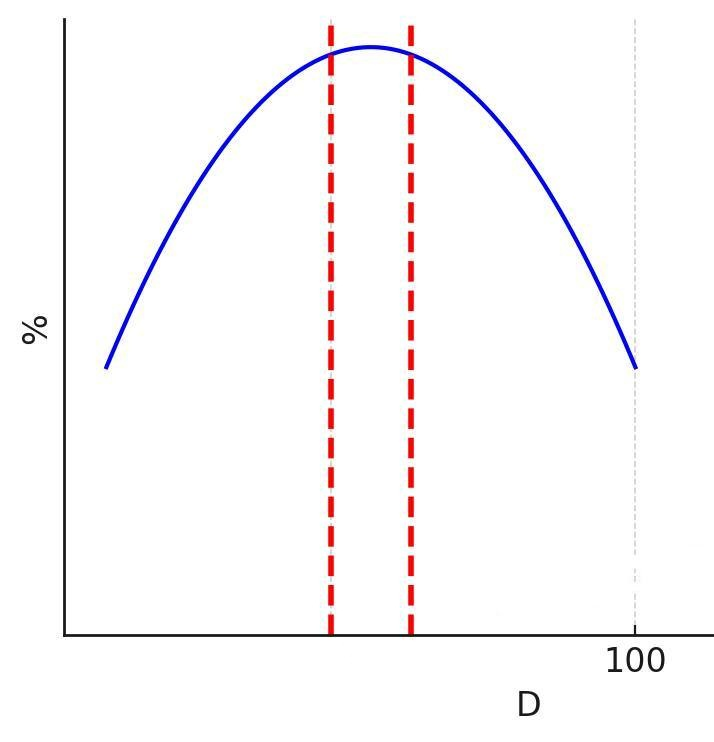

# Оптимизация процесса обогащения руды: интеллектуальный анализ гранулометрии

## 🔍 Ключевые проблемы, обнаруженные при анализе данных

При исследовании технологических данных обогатительной фабрики мы столкнулись с несколькими существенными проблемами:

- Треть всего времени производства значения потока и гранулометрии равны нулю, что значительно искажает значения корреляции значений
- **16051 пропущенное значение потока** (3% всех записей)
- **Отсутствие данных по оборотной воде** на первом участке
- **Транспортные задержки** между измерением и регулировкой параметров

## 📊 Выявленные закономерности при анализе данных

В результате анализа данных обнаружены важные зависимости:

1. **Наиболее частое значение входного потока** - около 260
2. **Кореляция гранулометра от потока**: снизилась до 0.05 после очистки данных
3. **Сильная обратная корреляция с возвратом руды** - ключевой фактор влияния

## 📈 Оптимальный размер частиц

Для оптимизации эффективности извлечения рудной фракции из пульпы критически важно обеспечить соответствие гранулометрического состава заданным параметрам. По результатам комплексного анализа технологических данных установлен оптимальный диапазон размера частиц на выходном продукте: 77-86 микрометров.

В рамках решения предусмотрена разработка системы автоматизированного контроля, осуществляющего:

1. Непрерывный мониторинг текущей дисперсности материала
2. Визуализацию отклонений от целевого диапазона
3. Генерацию сигналов обратной связи для корректировки помольного режима

Реализация данного функционала позволит повысить стабильность обогатительного процесса и минимизировать потери ценного компонента.

## 🛠 Предлагаемые решения

### Краткосрочные меры:

- Разрабать базу данных для удобного просмотра показаний из прошлого
- Создание системы визуализации, показывающей тренд изменения размера частиц на выходе
- Внедренить алгоритм определения попадания в оптимальный диапазон размера частиц

### Долгосрочные меры(при сотрудничестве фабрики):

- Разработка системы оповещения неверной настройки оборудования или сбоев
- Сотрудничество с лабораторией и производством для повышения точности определения размера гранул
- Внедрить алгоритм по учёту транспортных задержек при обработке пульпы
