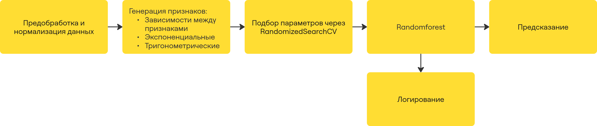
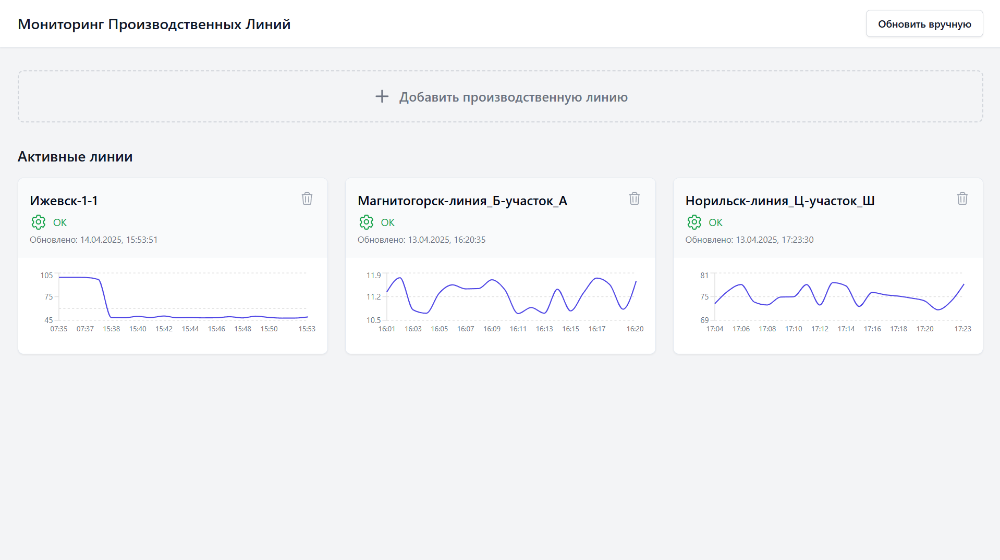
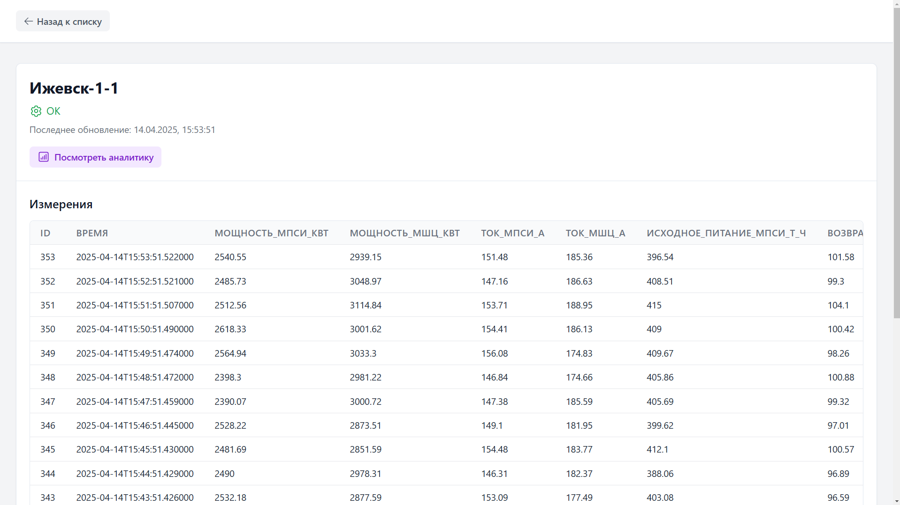
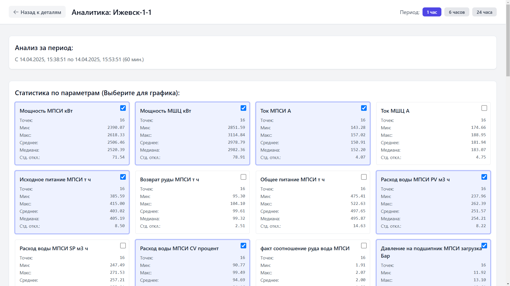
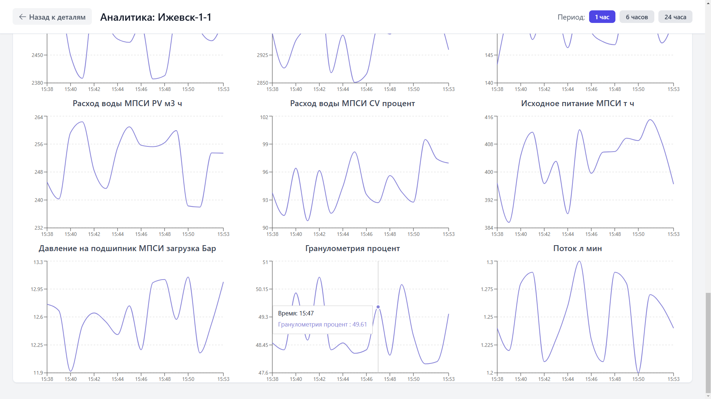

# **📊 Система для анализа, мониторинга и оптимизации гранулометрического состава руды**

## ✨ Ключевые возможности

* **Анализ данных:** Выявление размера частиц (гранулометрия) используя машинное обучение
* **API:** RESTful API для доступа к данным и функциям системы.
* **Универсальность:** Мониторинг можно запускать сразу с нескольких линий производства и даже с нескольких предприятий.
* **Веб-интерфейс:** Интерактивный интерфейс для визуализации данных и управления процессом. А также с обширным функционалом для мониторинга в виде всевозможных графиков и предсказания трендов.


<br></br>

# 📈 Отчет с исследованием данных

### 1) 🔍 EDA

## 🧠 Анализ данных и построение моделей

В рамках проекта был проведен детальный анализ данных для понимания взаимосвязей между технологическими параметрами и предсказания целевой переменной `Гранулометрия %`.

### 1. 📥 Загрузка и первичный осмотр данных

*   Данные были загружены из файла `../data/all_data.parquet`.
*   Проведена первичная оценка данных, включая размерность и список признаков.
*   Построена матрица корреляции для всех числовых параметров для выявления первоначальных взаимосвязей. `Поток л/мин` показал наиболее высокую положительную корреляцию (0.83) с `Гранулометрия %`.


### 2. 🛠️ Предобработка данных
[Jupyter Notebook с анализом данных](analyse/analys.ipynb)
*   **Анализ пропусков:** Выявлено небольшое количество пропусков в данных, наибольшее число (17901, ~3.1%) — в столбце `Поток л/мин`.
*   **Заполнение пропусков:** Оставшиеся пропуски в `Поток л/мин` были заполнены медианным значением после удаления нулевых строк.
*   **Анализ распределения потока:** Изучено распределение параметра `Поток л/мин` с помощью гистограмм, box plot, Q-Q plot и violin plot. Распределение близко к нормальному, с небольшой асимметрией и эксцессом.


*   **Выбросы:** Выбросы в `Поток л/мин` были идентифицированы с использованием межквартильного размаха (IQR). Они составили всего 0.05% данных. На данном этапе выбросы не удалялись.

*   **Обработка временного признака:** Столбец `Время` преобразован в числовой формат для использования в моделях.
*   **Удаление оставшихся пропусков:** Все строки с оставшимися пропусками в других столбцах были удалены перед обучением моделей.
*   **Сохранение обработанных данных:** Очищенный датасет сохранен в `../data/data_after_analys.parquet`.

### 3. 📊 Визуализация зависимостей

*   Построена диаграмма рассеяния для визуализации зависимости `Гранулометрия %` от `Возврат руды МПСИ т/ч`.


### 4. ⭐ Оценка важности признаков

*   С помощью модели `RandomForestRegressor` была оценена важность признаков для предсказания `Гранулометрия %`.
*   Наиболее важными признаками оказались `Возврат руды МПСИ т/ч`, `Поток л/мин`, `Время`, `Температура масла основной маслостанции слив МШЦ` и `Давление на подшипник МПСИ разгрузка Бар`.


### ✅ Вывод

Анализ данных выявил, что размер частиц (гранулометрия) сильно зависит от двух ключевых параметров: потока жидкости и количества возвращаемой руды в процессе.

### 2). 📏 Базовая модель для сравнения

Для начала мы создали простую базовую модель, чтобы понимать, от какого уровня отталкиваться:
- Разделили наши данные на обучающую и проверочную выборки
- На обучающей выборке рассчитали среднее значение гранулометрии
- На проверочной выборке измерили ошибку (RMSE), просто предсказывая это среднее значение для всех наблюдений

Получили такой результат:

```RMSE on validation set (predicting mean): 7.3443```

### 3) ⚙️ Pipeline


1. Предобработка и нормализация данных - обработаны все пропуски, данные нормализованы через standartscaler()
2. Генерация признаков - сгенерированы признаки являющиеся результатом сложения, перемножения, статистическими функциями, экспонентами и тригонометрическими функциями от исходных признаков. Отбор 52 важных фичей, у которых feature_importance больше 0.5%
3. Подбор параметров через RandomizedSearchCV для Random Forest (optuna не дала разительно большего качества, при этом работала дольше)
4. Randomforest с удобным логгированием, благодаря которому удобно отслеживать эксперименты
5. Итоговое предсказание модели


### 4) 🧪Проведённые эксперименты
#### Следущие эксперименты отличаются от исходного pipeline заменой соответсующих блоков (генерация признаков в итоговом pipeline заменялась на генерацию признаков с эксперимента). Все эксперименты можете посмотреть в [папке experiments](https://github.com/MISIS-x-OptonGroup/Marathon-Digital-Solutions/tree/main/experiments)

#### Эксперименты с генерацией фичей

- OpenFE - библиотека для автоматической генерации признаков(репозиторий библиотеки - https://github.com/IIIS-Li-Group/OpenFE, статья - https://arxiv.org/abs/2211.12507)

    Результат:
```RMSE on validation set: 2.1357```

- Featuretools - библиотека для автоматической генерации признаков(репозиторий библиотеки - https://github.com/alteryx/featuretools)
#### Эксперименты с отбором фичей
- Shap - https://github.com/shap/shap

    Результат:
    ```RMSE on validation set: 2.3056```

- Feature importance от catboost со стандартными параметрами

    Результат:
    ```RMSE on validation set: 2.4512```

- Boruta - библиотека для отбора признаков(https://github.com/scikit-learn-contrib/boruta_py?tab=readme-ov-file) - работает очень долго

    Результат:
    ```RMSE on validation set: 2.0981```

- Объединение - отбирали по 200 признаков каждый методом из перечисленных ранее и брали признаки на пересечении(работает очень долго)
    
    Результат:
    ```RMSE on validation set: 1.9298```

#### Эксперименты с моделями
- LinearRegression

    Результат:
    ```RMSE on validation set: 3.1355```
- CatBoost

    Результат:
    ```RMSE on validation set: 2.7642```
- LightAutoML (https://github.com/sb-ai-lab/LightAutoML)

    Результат:
    ```RMSE on validation set: 2.1623```
- LightAutoML Whitebox  (https://lightautoml.readthedocs.io/en/latest/_modules/lightautoml/ml_algo/whitebox.html)

    Результат:
    ```RMSE on validation set: 2.2985```
- AutoML с табличным трансформером

    Результат:
    ```RMSE on validation set: 2.3221```
- Ансамбль с SVR, Lasso и RandomForest

    Результат:
    ```RMSE on validation set: 2.0124```

### 6) 🏆 Какой лучший результат и скорость алгоритма

### Результаты нашей итоговой модели:

```RMSE: 1.8957```

```R²: 0.9334```

```MAE: 1.0209```

```MDAE: 0.5049```

```Объясненная дисперсия: 0.9334```

<br></br>

# ℹ️ О сервисе 

## 🎯 Применение

Наша система предназначена для мониторинга и анализа гранулометрического состава руды в режиме реального времени на нескольких производственных линиях (конвейерах).

1.  **Сбор данных:** Система подключается к серверам ваших конвейеров (поддерживается 10+ линий одновременно) и автоматически собирает данные измерений каждую минуту, сохраняя их в локальные `.csv` файлы.
2.  **Настройка мониторинга:** Через веб-интерфейс, доступный на мониторе, подключенном к серверу, оператор указывает пути к `.csv` файлам для каждой линии, которую необходимо отслеживать.
3.  **Непрерывный контроль:** После настройки система ежеминутно анализирует поступающие данные и рассчитывает текущую гранулометрию для каждой линии.
4.  **Обнаружение аномалий:** Система автоматически определяет нештатные ситуации, такие как:
    *   Остановка конвейера.
    *   Резкое падение или рост гранулометрии за пределы нормы.
5.  **Визуализация и оповещение:** Актуальная гранулометрия и статус каждой линии отображаются в веб-интерфейсе. При возникновении проблем статус линии немедленно обновляется, позволяя оперативно реагировать.
6.  **Анализ истории:** Система хранит историю измерений, что позволяет анализировать процесс обработки за предыдущие смены, выявлять ошибки и несоответствия при передаче смены.

## 🎉 Преимущества

*   **Экономическая эффективность:** Оптимизация гранулометрического состава позволяет значительно снизить издержки. По нашим оценкам, экономия может достигать **300+ миллионов рублей**.
*   **Оперативное реагирование:** Мгновенное (в течение минуты) обнаружение неисправностей и отклонений от нормы минимизирует простои и предотвращает дорогостоящие поломки оборудования, которые могли бы возникнуть при позднем обнаружении проблемы.
*   **Прозрачность процесса:** Возможность анализа исторических данных улучшает контроль над производственным процессом и облегчает поиск узких мест и причин сбоев.
*   **Масштабируемость:** Легко подключайте и отслеживайте до 10 и более конвейеров одновременно.

## 💻 Системные требования

Для работы сервера мониторинга и обучения рекомендуются следующие минимальные характеристики:

*   **Оперативная память (RAM):** Не менее 8 ГБ свободной памяти.
*   **Процессор (CPU):** Система не требовательна к процессору. Тестирование проводилось на AMD Ryzen 9; Возможно подойдет менее производительный современный процессор.
*   **Место на диске:** Не менее 0.5 ГБ свободного пространства для хранения данных и логов (рекомендуется больше при длительном хранении истории).


## 📄 Страницы сервиса

### 1) 🏠 Главная страница

На данной странице можно просмотреть:

* Все текущие производственные линии и их статус
* График изменения гранулометрии за последний час (относительно данных таблицы) для каждой линии.
* Добавить для мониторинга новые производственные линии
* Удалить ненужные линии из мониторинга
* Обновить данные вручуню (по умолчанию обновляются раз в 1 минуту)



### 2) 📅 Страница просмотра данных для отдельной линии

На данной странице можно просмотреть:

* Таблицу с данными (после обработки моделькой)
* Последнее обновление данных
* Название и статус линии
* Посмотреть аналитику по таблице



### 3) 📊 Страница с Аналитикой

На данной странице можно посмотреть:

* Выбрать период для анализа
* Выбрать параметры, по которым строить графики
* Посмотреть графики





## 🚀 Технологический стек

**Бэкенд:**

* **Язык:** Python 3.10+
* **Фреймворк:** FastAPI
* **База данных:** SQLite
* **ORM:** SQLAlchemy 2.0
* **Контейнеризация:** Docker (?)

**Фронтенд:**

* **Язык:** TypeScript
* **Фреймворк:** React
* **UI Библиотека:** Tailwind CSS, Shadcn UI
* **Сборщик:** Vite
* **Контейнеризация:** Docker (?)

**Анализ данных/ML:**

* **Scikit-learn**
* **Pandas**
* **NumPy**
* **SciPy**
* **Joblib**
* **psutil**

## 📂 Структура проекта

```python
.
├── backend/
│   ├── model/main.py # Класс для обучения модели
│   ├── utils/ # Вспомогательные функции
│   ├── requirements.txt # Зависимости Python
│   ├── server.py # Основной файл FastAPI приложения
│   └── run.py # Скрипт для запуска сервера
├── frontend/
│   ├── src/ # Исходный код фронтенда (компоненты, страницы, стили)
│   ├── public/ # Статические ассеты
│   ├── index.html # Главная страница
│   ├── package.json # Зависимости Node.js
│   ├── vite.config.ts # Конфигурация Vite
│   ├── tsconfig.json # Конфигурация TypeScript
│   ├── .gitignore # Файлы, игнорируемые Git
│   └── ... # tailwind.config.js и т.д.
├── docs/ # Изображения для Readme
├── data/ # Файлы с данными
├── .gitignore # Файлы, игнорируемые Git
├── scaler.pkl # Обученная модель
├── model.pkl  # Обученная модель
└── README.md  # Этот файл
```

## 🛠️ Установка и запуск

1. **Клонировать репозиторий:**

   ```bash
   git clone https://github.com/MISIS-x-OptonGroup/Marathon-Digital-Solutions.git
   cd Marathon-Digital-Solutions
   ```
2. **Установить зависимости**

   ```bash
   pip install -r backend/requirements.txt
   ```

   Бэкенд будет доступен по адресу: `http://localhost:8000/docs`
   Фронтенд будет доступен по адресу: `http://localhost:5173`

3. **Запуск проекта**

   ```
   python run.py
   ```

   ```
   cd Frontend
   npm install
   npm run dev
   ```

## ⚙️ API Документация

**Основные эндпоинты:**

* [GET] `/api/get`: Получить сводный статус для всех линий, ПРЕДВАРИТЕЛЬНО ОБНОВИВ ДАННЫЕ из CSV.
* [POST] `/api/add`: Добавить новую производственную линию для мониторинга.
* [DELETE] `/api/lines/{area_name}`: Удалить отслеживаемую линию и связанную с ней таблицу данных.
* [GET] `/api/lines/{area_name}`: Удалить отслеживаемую линию и связанную с ней таблицу данных.


# 📄 Лицензия: MIT
