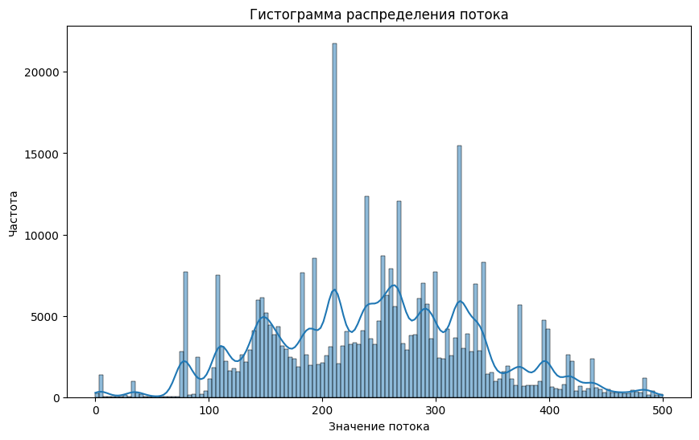

```python
import pandas as pd
from matplotlib import pyplot as plt 
import pyarrow.parquet as pa
import seaborn as sns
from scipy import stats
import numpy as np
```


```python
df = pd.read_parquet('../data/all_data.parquet')
df.shape
```


    (577518, 35)


```python
df.columns
```


    Index(['Время', 'Мощность МПСИ кВт', 'Мощность МШЦ кВт', 'Ток МПСИ А',
           'Ток МШЦ А', 'Исходное питание МПСИ т/ч', 'Возврат руды МПСИ т/ч',
           'Общее питание МПСИ т/ч', 'Расход воды МПСИ PV м3/ч',
           'Расход воды МПСИ SP м3/ч', 'Расход воды МПСИ CV %',
           'факт соотношение руда/вода МПСИ',
           'Давление на подшипник МПСИ загрузка Бар',
           'Давление на подшипник МПСИ разгрузка Бар',
           'Температура масла основной маслостанции подача МПСИ',
           'Температура масла основной маслостанции слив МПСИ',
           'Температура масла маслостанции электродвигатель МПСИ',
           'Температура масла редуктора МПСИ',
           'Давление на подшипник МШЦ загрузка Бар',
           'Давление на подшипник МШЦ разгрузка Бар',
           'Температура масла основной маслостанции подача МШЦ',
           'Температура масла основной маслостанции слив МШЦ',
           'Температура масла маслостанции электродвигатель МШЦ',
           'Температура масла редуктора МШЦ', 'Расход извести МШЦ л/ч',
           'Уровень в зумпфе %', 'Обороты насоса %', 'Давление в ГЦ насоса Бар',
           'Плотность слива ГЦ кг/л', 'pH оборотной воды', 't оборотной воды',
           'Гранулометрия %', 'Поток л/мин', 'Расход оборотной воды м3/ч',
           'Расход в ГЦ насоса м3/ч'],
          dtype='object')


##  Предобработка данных


```python
correlation_matrix = df.drop(columns=['Время']).corr()

plt.figure(figsize=(30, 48))  # Увеличил размер фигуры примерно в 3 раза

sns.heatmap(correlation_matrix, 
            annot=True,           # Показывать значения
            fmt='.2f',            # Формат чисел (2 десятичных знака)
            cmap='coolwarm',      # Цветовая схема
            center=0,             # Центр цветовой шкалы
            vmin=-1,              # Минимальное значение
            vmax=1,
            linewidths=0.5,       # Добавил линии между ячейками для лучшей читаемости
            cbar_kws={'shrink': .8})  # Немного уменьшил размер цветовой шкалы

plt.title('Корреляция параметров', fontsize=20)  # Увеличил размер заголовка
plt.tight_layout()  # Улучшил компоновку
```


    

    


```python
correlation_matrix['Гранулометрия %'].sort_values(ascending=False)
```


    Гранулометрия %                                         1.000000
    Поток л/мин                                             0.829650
    pH оборотной воды                                       0.187252
    Возврат руды МПСИ т/ч                                   0.184368
    Исходное питание МПСИ т/ч                               0.133128
    Общее питание МПСИ т/ч                                  0.129103
    Расход воды МПСИ SP м3/ч                                0.128035
    Мощность МПСИ кВт                                       0.108638
    Ток МПСИ А                                              0.107576
    Расход оборотной воды м3/ч                              0.102358
    Мощность МШЦ кВт                                        0.091556
    Ток МШЦ А                                               0.091542
    Расход в ГЦ насоса м3/ч                                 0.083984
    Расход воды МПСИ PV м3/ч                                0.077346
    Уровень в зумпфе %                                      0.073244
    Расход воды МПСИ CV %                                   0.069067
    Давление на подшипник МПСИ загрузка Бар                 0.045513
    Давление на подшипник МПСИ разгрузка Бар                0.042658
    Температура масла маслостанции электродвигатель МШЦ     0.042583
    Температура масла основной маслостанции слив МШЦ        0.042574
    Расход извести МШЦ л/ч                                  0.038705
    Температура масла редуктора МШЦ                         0.035493
    Плотность слива ГЦ кг/л                                 0.034397
    Температура масла основной маслостанции слив МПСИ       0.033596
    Температура масла маслостанции электродвигатель МПСИ    0.028609
    Температура масла редуктора МПСИ                        0.023946
    Обороты насоса %                                        0.021628
    Температура масла основной маслостанции подача МШЦ      0.019474
    Температура масла основной маслостанции подача МПСИ     0.009649
    Давление на подшипник МШЦ загрузка Бар                 -0.000525
    Давление на подшипник МШЦ разгрузка Бар                -0.003986
    факт соотношение руда/вода МПСИ                        -0.005431
    t оборотной воды                                       -0.013821
    Давление в ГЦ насоса Бар                               -0.014935
    Name: Гранулометрия %, dtype: float64


### 1. Количество пустых значений в начальном датасете


```python
print(df.isna().sum(axis=0))

print(f'\n\nПроцентное соотношение пропусков: {df.isna().sum(axis=0).max()/len(df)*100}%')
```

    Время                                                       0
    Мощность МПСИ кВт                                          50
    Мощность МШЦ кВт                                           50
    Ток МПСИ А                                                 50
    Ток МШЦ А                                                  50
    Исходное питание МПСИ т/ч                                  50
    Возврат руды МПСИ т/ч                                      50
    Общее питание МПСИ т/ч                                     50
    Расход воды МПСИ PV м3/ч                                   50
    Расход воды МПСИ SP м3/ч                                   50
    Расход воды МПСИ CV %                                      50
    факт соотношение руда/вода МПСИ                            50
    Давление на подшипник МПСИ загрузка Бар                    50
    Давление на подшипник МПСИ разгрузка Бар                   50
    Температура масла основной маслостанции подача МПСИ        25
    Температура масла основной маслостанции слив МПСИ          25
    Температура масла маслостанции электродвигатель МПСИ       25
    Температура масла редуктора МПСИ                           25
    Давление на подшипник МШЦ загрузка Бар                     25
    Давление на подшипник МШЦ разгрузка Бар                    25
    Температура масла основной маслостанции подача МШЦ         25
    Температура масла основной маслостанции слив МШЦ           25
    Температура масла маслостанции электродвигатель МШЦ        25
    Температура масла редуктора МШЦ                            25
    Расход извести МШЦ л/ч                                     25
    Уровень в зумпфе %                                         20
    Обороты насоса %                                           40
    Давление в ГЦ насоса Бар                                   40
    Плотность слива ГЦ кг/л                                    20
    pH оборотной воды                                          50
    t оборотной воды                                           50
    Гранулометрия %                                            34
    Поток л/мин                                             17901
    Расход оборотной воды м3/ч                                 25
    Расход в ГЦ насоса м3/ч                                    20
    dtype: int64
    
    
    Процентное соотношение пропусков: 3.099643647470728%
    

# Анализ Потока

В нашем датасете есть **178099** строчек, где Поток = 0


```python
is_potok0 = (df['Поток л/мин'] == 0).values
potok0_inds = [ i for i in range(len(is_potok0)) if is_potok0[i] ]
len(potok0_inds)
```


    178099


При потоке=0 мы видим, что 178097 значений Гранулометрии = 0, что составляет **99.998%**, значит в этот момент ничего не работало, можем удалить эти строчки


```python
cnt_gralunometr0_potok0 = 0

for ind in potok0_inds:
    if df['Гранулометрия %'][ind] == 0:
        cnt_gralunometr0_potok0 += 1

print(cnt_gralunometr0_potok0)
f'Соотношение Гранулометрии = 0 при Потоке = 0: {cnt_gralunometr0_potok0/len(potok0_inds)*100}%'


```

    178097
    


    'Соотношение Гранулометрии = 0 при Потоке = 0: 99.9988770290681%'


```python
print('длина до удаления строк с Потоком = 0:', df.shape)
df.drop(potok0_inds, inplace=True)
print('длина после удаления строк с Потоком = 0:', df.shape)
```

    длина до удаления строк с Потоком = 0: (577518, 35)
    длина после удаления строк с Потоком = 0: (399419, 35)
    

Продолжаем анализировать наши данные потока, сделаем гистограмму распределения потока


```python
fig, axes = plt.subplots(1, 1, figsize=(10, 6))
sns.histplot(data=df, x='Поток л/мин', kde=True, ax=axes)
axes.set_title('Гистограмма распределения потока')
axes.set_xlabel('Значение потока')
axes.set_ylabel('Частота')
```


    Text(0, 0.5, 'Частота')


    

    


Есть 17901 пропущенных значений потока, попробуем восстановить их с помощью медианы


```python
df['Поток л/мин'].isna().sum()
```


    17901


```python
# Получаем индексы строк с пропущенными значениями потока
missing_flow_mask = df['Поток л/мин'].isna()
# Получаем индексы строк где гранулометрия = 0
zero_granulometry_mask = df['Гранулометрия %'] == 0
# Находим пересечение масок
zero_gran_missing_flow = missing_flow_mask & zero_granulometry_mask
# Выводим индексы строк где есть пересечение
print(df[zero_gran_missing_flow].index.tolist())

```

    []
    


```python
df['Поток л/мин'] = df['Поток л/мин'].fillna(df['Поток л/мин'].median())
```

Посмотрим на новую гистограмму распределения потока, уже выглядит получше


```python
fig, axes = plt.subplots(1, 1, figsize=(10, 6))
sns.histplot(data=df, x='Поток л/мин', kde=True, ax=axes)
axes.set_title('Гистограмма распределения потока')
axes.set_xlabel('Значение потока')
axes.set_ylabel('Частота')
```


    Text(0, 0.5, 'Частота')


    

    


Теперь узнаем какие параметры сильно коррелируют между собой


```python
correlation_matrix = df.drop(columns=['Время']).corr()

plt.figure(figsize=(30, 48))  # Увеличил размер фигуры примерно в 3 раза

sns.heatmap(correlation_matrix, 
            annot=True,           # Показывать значения
            fmt='.2f',            # Формат чисел (2 десятичных знака)
            cmap='coolwarm',      # Цветовая схема
            center=0,             # Центр цветовой шкалы
            vmin=-1,              # Минимальное значение
            vmax=1,
            linewidths=0.5,       # Добавил линии между ячейками для лучшей читаемости
            cbar_kws={'shrink': .8})  # Немного уменьшил размер цветовой шкалы

plt.title('Корреляция параметров', fontsize=20)  # Увеличил размер заголовка
plt.tight_layout()  # Улучшил компоновку
```


    

    


### Создаем подграфики для разных типов визуализации


```python
fig, axes = plt.subplots(2, 2, figsize=(15, 10))

# Гистограмма с кривой плотности
sns.histplot(data=df, x='Поток л/мин', kde=True, ax=axes[0,0])
axes[0,0].set_title('Гистограмма распределения потока')
axes[0,0].set_xlabel('Значение потока')
axes[0,0].set_ylabel('Частота')

# (Box plot)
sns.boxplot(data=df, y='Поток л/мин', ax=axes[0,1])
axes[0,1].set_title('Box plot потока')
axes[0,1].set_ylabel('Значение потока')

# QQ-plot для проверки на нормальность
stats.probplot(df['Поток л/мин'].dropna(), dist="norm", plot=axes[1,0])
axes[1,0].set_title('Q-Q plot потока')

# Violin plot
sns.violinplot(data=df, y='Поток л/мин', ax=axes[1,1])
axes[1,1].set_title('Violin plot потока')
axes[1,1].set_ylabel('Значение потока')

```


    Text(0, 0.5, 'Значение потока')


    

    


# Создаем график зависимости гранулометрии от потока


```python
df.columns
```


    Index(['Время', 'Мощность МПСИ кВт', 'Мощность МШЦ кВт', 'Ток МПСИ А',
           'Ток МШЦ А', 'Исходное питание МПСИ т/ч', 'Возврат руды МПСИ т/ч',
           'Общее питание МПСИ т/ч', 'Расход воды МПСИ PV м3/ч',
           'Расход воды МПСИ SP м3/ч', 'Расход воды МПСИ CV %',
           'факт соотношение руда/вода МПСИ',
           'Давление на подшипник МПСИ загрузка Бар',
           'Давление на подшипник МПСИ разгрузка Бар',
           'Температура масла основной маслостанции подача МПСИ',
           'Температура масла основной маслостанции слив МПСИ',
           'Температура масла маслостанции электродвигатель МПСИ',
           'Температура масла редуктора МПСИ',
           'Давление на подшипник МШЦ загрузка Бар',
           'Давление на подшипник МШЦ разгрузка Бар',
           'Температура масла основной маслостанции подача МШЦ',
           'Температура масла основной маслостанции слив МШЦ',
           'Температура масла маслостанции электродвигатель МШЦ',
           'Температура масла редуктора МШЦ', 'Расход извести МШЦ л/ч',
           'Уровень в зумпфе %', 'Обороты насоса %', 'Давление в ГЦ насоса Бар',
           'Плотность слива ГЦ кг/л', 'pH оборотной воды', 't оборотной воды',
           'Гранулометрия %', 'Поток л/мин', 'Расход оборотной воды м3/ч',
           'Расход в ГЦ насоса м3/ч'],
          dtype='object')


```python
plt.figure(figsize=(10, 6))
plt.scatter(df['Возврат руды МПСИ т/ч'], df['Гранулометрия %'], alpha=0.5)
plt.title('Зависимость гранулометрии от потока')
plt.xlabel('Возврат руды МПСИ')
plt.ylabel('Гранулометрия')
plt.grid(True)

```


    

    


### Вывод основных статистик


```python
print("\nОсновные статистические показатели потока:")
print(df['Поток л/мин'].describe())
```

    
    Основные статистические показатели потока:
    count    399419.000000
    mean        247.029634
    std          89.140923
    min           0.002083
    25%         184.369644
    50%         250.440872
    75%         308.934875
    max         499.989227
    Name: Поток л/мин, dtype: float64
    

### Расчет асимметрии и эксцесса


```python
print("\nДополнительные характеристики распределения:")
print(f"Асимметрия: {df['Поток л/мин'].skew():.3f}")
print(f"Эксцесс: {df['Поток л/мин'].kurtosis():.3f}")
```

    
    Дополнительные характеристики распределения:
    Асимметрия: 0.062
    Эксцесс: -0.205
    

### Определение выбросов методом межквартильного размаха


```python
Q1 = df['Поток л/мин'].quantile(0.25)
Q3 = df['Поток л/мин'].quantile(0.75)
IQR = Q3 - Q1
lower_bound = Q1 - 1.5 * IQR
upper_bound = Q3 + 1.5 * IQR

outliers = df[(df['Поток л/мин'] < lower_bound) | (df['Поток л/мин'] > upper_bound)]['Поток л/мин']
print(f"\nКоличество выбросов: {len(outliers)}")
print(f"Процент выбросов: {(len(outliers)/len(df['Поток л/мин'])*100):.2f}%")
print(f"Нижняя граница выбросов: {lower_bound:.2f}")
print(f"Верхняя граница выбросов: {upper_bound:.2f}")
```

    
    Количество выбросов: 212
    Процент выбросов: 0.05%
    Нижняя граница выбросов: -2.48
    Верхняя граница выбросов: 495.78
    

### График плотности с выбросами


```python
plt.figure(figsize=(12, 6))
sns.kdeplot(data=df, x='Гранулометрия %', fill=True)
plt.axvline(x=lower_bound, color='r', linestyle='--', label='Границы выбросов')
plt.axvline(x=upper_bound, color='r', linestyle='--')
plt.title('Распределение потока с границами выбросов')
```


    Text(0.5, 1.0, 'Распределение потока с границами выбросов')


    

    


# Оценка важности параметров для предсказания Гранулометрии


```python
from sklearn.ensemble import RandomForestRegressor, GradientBoostingRegressor
from sklearn.preprocessing import StandardScaler
from sklearn.model_selection import train_test_split
```


```python
df = df.dropna()
df["Гранулометрия %"].isna().sum()
```


    0


```python
# Преобразуем столбец 'Время' в datetime
df['Время'] = pd.to_datetime(df['Время'])
```


```python
df.to_parquet('../data/data_after_analys.parquet')
```


```python
X = df.drop(['Гранулометрия %'], axis=1)
y = df['Гранулометрия %']
```


```python
# Преобразуем данные в числовой формат
X = X.apply(pd.to_numeric, errors='coerce')
X = X.fillna(X.mean())
```


```python
print("Типы данных в признаках:")
print(X.dtypes)
```

    Типы данных в признаках:
    Время                                                     int64
    Мощность МПСИ кВт                                       float64
    Мощность МШЦ кВт                                        float64
    Ток МПСИ А                                              float64
    Ток МШЦ А                                               float64
    Исходное питание МПСИ т/ч                               float64
    Возврат руды МПСИ т/ч                                   float64
    Общее питание МПСИ т/ч                                  float64
    Расход воды МПСИ PV м3/ч                                float64
    Расход воды МПСИ SP м3/ч                                float64
    Расход воды МПСИ CV %                                   float64
    факт соотношение руда/вода МПСИ                         float64
    Давление на подшипник МПСИ загрузка Бар                 float64
    Давление на подшипник МПСИ разгрузка Бар                float64
    Температура масла основной маслостанции подача МПСИ     float64
    Температура масла основной маслостанции слив МПСИ       float64
    Температура масла маслостанции электродвигатель МПСИ    float64
    Температура масла редуктора МПСИ                        float64
    Давление на подшипник МШЦ загрузка Бар                  float64
    Давление на подшипник МШЦ разгрузка Бар                 float64
    Температура масла основной маслостанции подача МШЦ      float64
    Температура масла основной маслостанции слив МШЦ        float64
    Температура масла маслостанции электродвигатель МШЦ     float64
    Температура масла редуктора МШЦ                         float64
    Расход извести МШЦ л/ч                                  float64
    Уровень в зумпфе %                                      float64
    Обороты насоса %                                        float64
    Давление в ГЦ насоса Бар                                float64
    Плотность слива ГЦ кг/л                                 float64
    pH оборотной воды                                       float64
    t оборотной воды                                        float64
    Поток л/мин                                             float64
    Расход оборотной воды м3/ч                              float64
    Расход в ГЦ насоса м3/ч                                 float64
    dtype: object
    


```python
X_train, X_test, y_train, y_test = train_test_split(X, y, test_size=0.2, random_state=42)
```


```python
# Масштабирование признаков
scaler = StandardScaler()
X_scaled_train = scaler.fit_transform(X_train)
X_scaled_train = pd.DataFrame(X_scaled_train, columns=X_train.columns)
X_scaled_test = scaler.transform(X_test)
X_scaled_test = pd.DataFrame(X_scaled_test, columns=X_test.columns)
```

## Делаем РандомФорест


```python
#  RandomForestRegressor
rf_model = RandomForestRegressor(n_estimators=5, random_state=42)
rf_model.fit(X_scaled_train, y_train)

# Важность признаков из RandomForestRegressor
gb_importance = pd.DataFrame({
    'feature': X.columns,
    'importance': rf_model.feature_importances_
})
gb_importance = gb_importance.sort_values('importance', ascending=False)

plt.figure(figsize=(12, 8))
sns.barplot(x='importance', y='feature', data=gb_importance)
plt.title('Важность признаков (RandomForestRegressor)')
plt.tight_layout()
plt.show()

print("\nТоп-10 признаков по RandomForestRegressor:")
print(gb_importance.head(10))
```


    

    


    
    Топ-10 признаков по RandomForestRegressor:
                                                  feature  importance
    6                               Возврат руды МПСИ т/ч    0.195646
    31                                        Поток л/мин    0.175210
    0                                               Время    0.100557
    21   Температура масла основной маслостанции слив МШЦ    0.074923
    13           Давление на подшипник МПСИ разгрузка Бар    0.055113
    30                                   t оборотной воды    0.047995
    14  Температура масла основной маслостанции подача...    0.038551
    28                            Плотность слива ГЦ кг/л    0.033670
    4                                           Ток МШЦ А    0.032333
    2                                    Мощность МШЦ кВт    0.031801
    


```python
from sklearn.metrics import mean_squared_error, r2_score

# Делаем предсказания на тестовом наборе
y_pred = rf_model.predict(X_scaled_test)

# Оцениваем качество модели
mse = mean_squared_error(y_test, y_pred)
rmse = np.sqrt(mse)
r2 = r2_score(y_test, y_pred)

print("Метрики качества модели на тестовой выборке:")
print(f"Среднеквадратичная ошибка (MSE): {mse:.4f}")
print(f"Корень из среднеквадратичной ошибки (RMSE): {rmse:.4f}") 
print(f"Коэффициент детерминации (R²): {r2:.4f}")
from sklearn.metrics import median_absolute_error
mae = median_absolute_error(y_test, y_pred)
print(f"Медианная абсолютная ошибка (MAE): {mae:.4f}")
print()

# Визуализация результатов
plt.figure(figsize=(10, 6))
plt.scatter(y_test, y_pred, alpha=0.5)
plt.plot([y_test.min(), y_test.max()], [y_test.min(), y_test.max()], 'r--', lw=2)
plt.xlabel('Фактические значения')
plt.ylabel('Предсказанные значения')
plt.title('Сравнение фактических и предсказанных значений')
plt.tight_layout()
plt.show()

```

    Метрики качества модели на тестовой выборке:
    Среднеквадратичная ошибка (MSE): 2.8245
    Корень из среднеквадратичной ошибки (RMSE): 1.6806
    Коэффициент детерминации (R²): 0.9476
    Медианная абсолютная ошибка (MAE): 0.0055
    
    


    

    


## Делаем CatBoost


```python
from catboost import CatBoostRegressor

cat_model = CatBoostRegressor(n_estimators=10, random_state=42)
cat_model.fit(X_scaled_train, y_train)

y_pred_cat = cat_model.predict(X_scaled_test)

mse_cat = mean_squared_error(y_test, y_pred_cat)
rmse_cat = np.sqrt(mse_cat)
r2_cat = r2_score(y_test, y_pred_cat)

```

    Learning rate set to 0.5
    0:	learn: 5.8525148	total: 276ms	remaining: 2.48s
    1:	learn: 5.2547031	total: 342ms	remaining: 1.37s
    2:	learn: 4.9122492	total: 401ms	remaining: 935ms
    3:	learn: 4.6650453	total: 465ms	remaining: 697ms
    4:	learn: 4.5382330	total: 530ms	remaining: 530ms
    5:	learn: 4.4231142	total: 590ms	remaining: 394ms
    6:	learn: 4.3273766	total: 654ms	remaining: 280ms
    7:	learn: 4.2103539	total: 725ms	remaining: 181ms
    8:	learn: 4.1512938	total: 789ms	remaining: 87.6ms
    9:	learn: 4.1073731	total: 841ms	remaining: 0us
    


```python
from sklearn.metrics import mean_squared_error, r2_score

# Делаем предсказания на тестовом наборе
y_pred_cat = cat_model.predict(X_scaled_test)

# Оцениваем качество модели
mse_cat = mean_squared_error(y_test, y_pred_cat)
rmse_cat = np.sqrt(mse_cat)
r2_cat = r2_score(y_test, y_pred_cat)

print("Метрики качества модели CatBoost на тестовой выборке:")
print(f"Среднеквадратичная ошибка (MSE): {mse_cat:.4f}")
print(f"Корень из среднеквадратичной ошибки (RMSE): {rmse_cat:.4f}") 
print(f"Коэффициент детерминации (R²): {r2_cat:.4f}")
from sklearn.metrics import median_absolute_error
mae_cat = median_absolute_error(y_test, y_pred_cat)
print(f"Медианная абсолютная ошибка (MAE): {mae_cat:.4f}")
print()

# Визуализация результатов
plt.figure(figsize=(10, 6))
plt.scatter(y_test, y_pred_cat, alpha=0.5)
plt.plot([y_test.min(), y_test.max()], [y_test.min(), y_test.max()], 'r--', lw=2)
plt.xlabel('Фактические значения')
plt.ylabel('Предсказанные значения')
plt.title('Сравнение фактических и предсказанных значений (CatBoost)')
plt.tight_layout()
plt.show()

```

    Метрики качества модели CatBoost на тестовой выборке:
    Среднеквадратичная ошибка (MSE): 16.9026
    Корень из среднеквадратичной ошибки (RMSE): 4.1113
    Коэффициент детерминации (R²): 0.6866
    Медианная абсолютная ошибка (MAE): 1.9131
    
    


    

    


## Делаем LinearRegression


```python
from sklearn.linear_model import LinearRegression

# Создаем и обучаем модель линейной регрессии
lr_model = LinearRegression()
lr_model.fit(X_scaled_train, y_train)

# Делаем предсказания
y_pred_lr = lr_model.predict(X_scaled_test)

# Оцениваем качество модели
mse_lr = mean_squared_error(y_test, y_pred_lr)
rmse_lr = np.sqrt(mse_lr)
r2_lr = r2_score(y_test, y_pred_lr)
```


```python
from sklearn.metrics import mean_squared_error, r2_score

# Делаем предсказания на тестовом наборе
y_pred_lr = lr_model.predict(X_scaled_test)

# Оцениваем качество модели
mse_lr = mean_squared_error(y_test, y_pred_lr)
rmse_lr = np.sqrt(mse_lr)
r2_lr = r2_score(y_test, y_pred_lr)

print("Метрики качества модели линейной регрессии на тестовой выборке:")
print(f"Среднеквадратичная ошибка (MSE): {mse_lr:.4f}")
print(f"Корень из среднеквадратичной ошибки (RMSE): {rmse_lr:.4f}") 
print(f"Коэффициент детерминации (R²): {r2_lr:.4f}")
from sklearn.metrics import median_absolute_error
mae_lr = median_absolute_error(y_test, y_pred_lr)
print(f"Медианная абсолютная ошибка (MAE): {mae_lr:.4f}")
print()

# Визуализация результатов
plt.figure(figsize=(10, 6))
plt.scatter(y_test, y_pred_lr, alpha=0.5)
plt.plot([y_test.min(), y_test.max()], [y_test.min(), y_test.max()], 'r--', lw=2)
plt.xlabel('Фактические значения')
plt.ylabel('Предсказанные значения')
plt.title('Сравнение фактических и предсказанных значений (Линейная регрессия)')
plt.tight_layout()
plt.show()

```

    Метрики качества модели линейной регрессии на тестовой выборке:
    Среднеквадратичная ошибка (MSE): 34.8520
    Корень из среднеквадратичной ошибки (RMSE): 5.9036
    Коэффициент детерминации (R²): 0.3538
    Медианная абсолютная ошибка (MAE): 3.3300
    
    


    

    


```python

```
